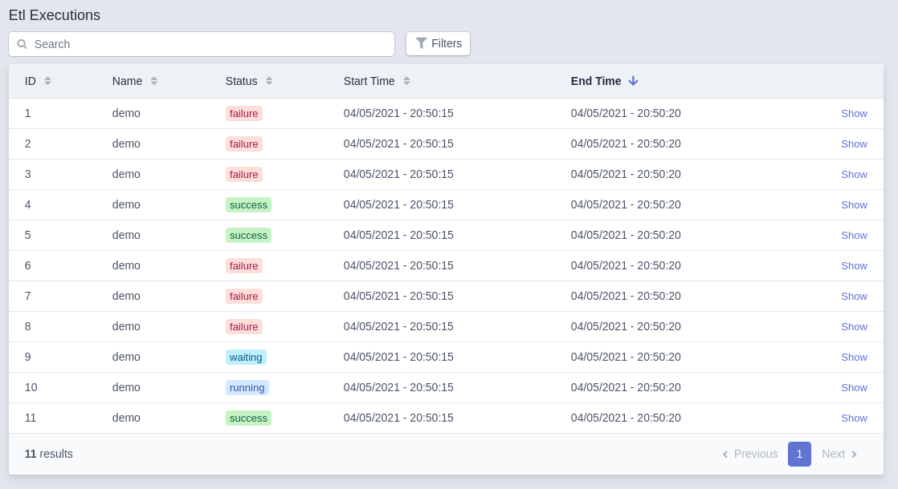
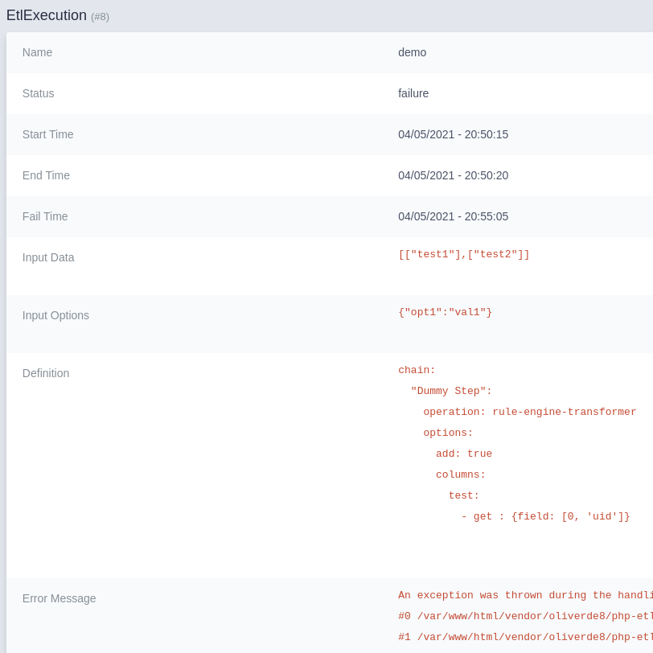
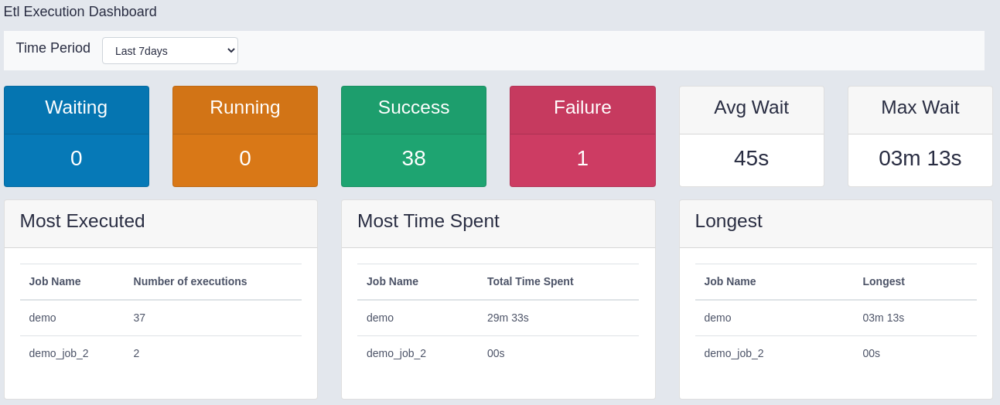

# PHP Etl Easy Admin Bundle

<!-- TO BE COMPLETED -->

The Php etl easy admin bundle allows the usage of [Oliver's PHP Etl](https://github.com/oliverde8/php-etl) library in symfony. 
Add's an integration to easy admin as well in order to see a list of the executions:



And also a details on each execution. Logs of each execution and files processed in each execution can also be found here



Also provides a dashboard to see current state. 




## Installation

1. Install using composer

2. in `/config/` create a directory `etl`

3. Enable bundle: 
```php
    \Oliverde8\PhpEtlBundle\Oliverde8PhpEtlEasyAdminBundle::class => ['all' => true],
```

4. Add to easy admin
```php
yield MenuItem::linktoRoute("Job Dashboard", 'fas fa-chart-bar', "etl_execution_dashboard");
yield MenuItem::linkToCrud('Etl Executions', 'fas fa-list', EtlExecution::class);
```

5. Enable routes
```yaml
etl_bundle:
  resource: '@Oliverde8PhpEtlEasyAdminBundle/Controller'
  type: annotation
  prefix: /admin
```

6. Optional: Enable queue if you wish to allow users from the easy admin panel to do executions.
```yaml
framework:
  messenger:
    routing:
        "Oliverde8\PhpEtlBundle\Message\EtlExecutionMessage": async
```

6. Optional: Enable creation of individual files for each log by editing the monolog.yaml
```yaml
etl:
    type: service
    id: Oliverde8\PhpEtlBundle\Services\ChainExecutionLogger
    level: debug
    channels: ["!event"]
```

## Usage

Please check the documentation of the [Php Etl Bundle](https://github.com/oliverde8/phpEtlBundle)

For more information on how the etl works and how to create operations check the [Php Etl Documentation](https://github.com/oliverde8/php-etl#creating-you-own-operations)

## TODO
- Add possibility to create etl chains definitions from the interface.  
