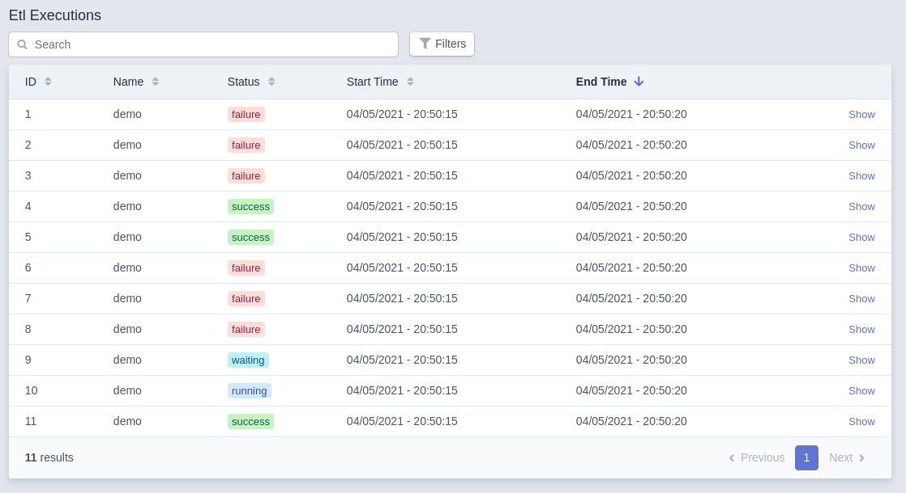
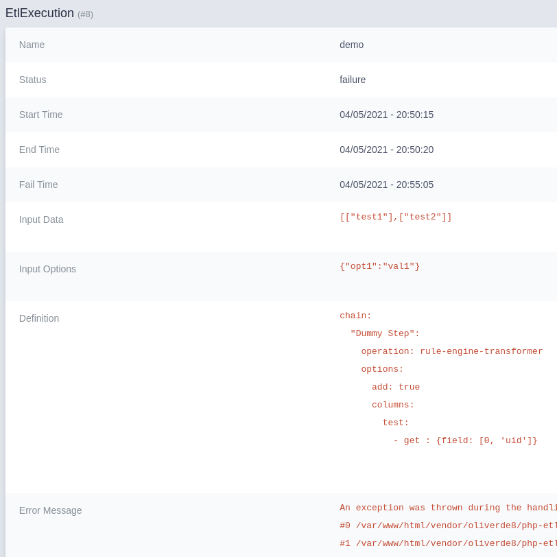
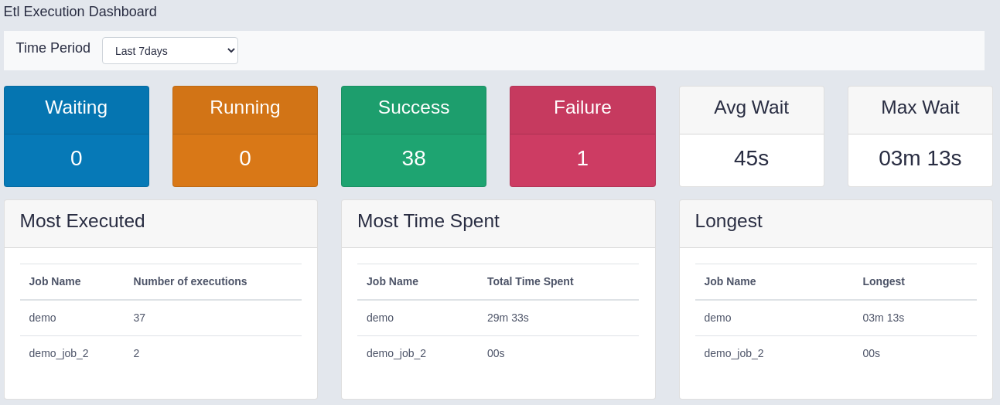

# PHP Etl Easy Admin Bundle

The Php etl easy admin bundle allows the usage of [Oliver's PHP Etl](https://github.com/oliverde8/php-etl) library in symfony. 
Add's an integration to easy admin as well in order to see a list of the executions:



And also a details on each execution. Logs of each execution and files processed in each execution can also be found here



Also provides a dashboard to see current state. 




## Installation

1. Install using composer

2. in `/config/` create a directory `etl`

3. Enable bundle: 
```php
    Oliverde8\PhpEtlEasyAdminBundle\Oliverde8PhpEtlEasyAdminBundle::class => ['all' => true],
```

4. Add to easy admin
```php
// EtlDashboardController exposes the stats page via #[AdminRoute(name: 'etl_execution_dashboard')].
// EasyAdmin prefixes it with your Dashboard's own route name, e.g. "admin_etl_execution_dashboard".
yield MenuItem::linkToRoute("Job Dashboard", 'fas fa-chart-bar', "admin_etl_execution_dashboard");
yield MenuItem::linkToCrud('Etl Executions', 'fas fa-list', EtlExecution::class);
```

5. Enable routes. The execution detail page's live graph reads its data from the
   php-etl bundle's endpoints, so its routes must be loaded too. Put both behind your admin firewall.
```yaml
etl_bundle:
  resource: '@Oliverde8PhpEtlEasyAdminBundle/Controller'
  type: attribute
  prefix: /admin

oliverde8_php_etl_observability:
  resource: '@Oliverde8PhpEtlBundle/Controller/'
  type: attribute
  prefix: /admin
```

6. Install the assets (the graph's JS/CSS are shipped by the php-etl bundle):
```bash
bin/console assets:install public
```

> **Security:** `EtlExecutionVoter` currently grants access to everyone. Access to executions,
> their graph/state/log endpoints and their live updates is only protected by your own
> firewall / `access_control` rules, so make sure `/admin` (or whatever prefix you use) is restricted.

7. Optional: Enable queue if you wish to allow users from the easy admin panel to do executions.
```yaml
framework:
  messenger:
    routing:
        "Oliverde8\PhpEtlBundle\Message\EtlExecutionMessage": async
```

8. Optional: Enable creation of individual files for each log by editing the monolog.yaml
```yaml
etl:
    type: service
    id: Oliverde8\PhpEtlBundle\Services\ChainExecutionLogger
    level: debug
    channels: ["!event"]
```

9. Optional: Real-time execution graph. Without anything extra the graph on the execution detail page
   polls while an execution is running and is static once it is finished. Install and configure
   `symfony/mercure-bundle` to get live updates pushed instead; the php-etl bundle detects it automatically.
   Live updates only apply to executions run asynchronously (step 7).
```bash
composer require symfony/mercure-bundle
```

## Usage

Please check the documentation of the [Php Etl Bundle](https://github.com/oliverde8/phpEtlBundle)

For more information on how the etl works and how to create operations check the [Php Etl Documentation](https://github.com/oliverde8/php-etl#creating-you-own-operations)

## TODO
- Add possibility to create etl chains definitions from the interface.  
